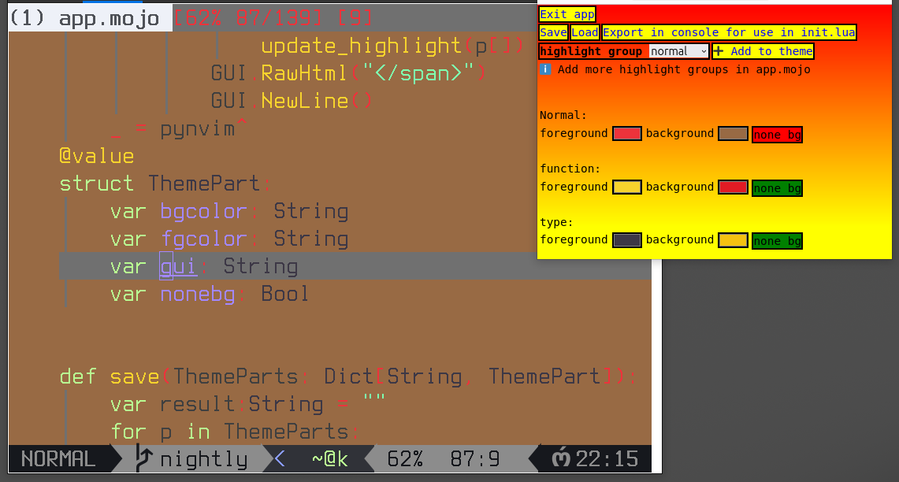

# 🔥🎨🎛️ mojo_neovim_theme_app

It is a tool to create neovim themes in real-time. [see example](#the-app-and-neovim)


The tool have to be built with `mojo nightly`!


&nbsp;

Any `highlight` group can be added and customized (`foreground`,`background`).

So it works with any languages out of the box!

(just open a `.js` in neovim for example)

&nbsp;

Once satified, it is possible to press the export button,

It will print in the console the changes for `init.lua`.


&nbsp;

# Uses `pynvim`

This tool import the `pynvim` python package.

#### Installation guide with `pip`:
https://github.com/neovim/pynvim

Make sure it is pip installed in the Python environement that mojo uses.

(the package is imported by the cpython interepreter at runtime)

&nbsp;


# Installation
There are extra steps, because `mojo-ui-html` is not currently a package.

*(Under construction and it has to import theme.css, base.js, ..)*

&nbsp;

1. `Clone` `mojo_neovim_theme_app`
```bash
git clone https://github.com/rd4com/mojo_neovim_theme_app.git
```

2. `cd` into `mojo_neovim_theme_app`
```bash
cd mojo_neovim_theme_app
```

3. `Clone` `mojo-ui-html` (the `nightly branch`!)
```bash
git clone https://github.com/rd4com/mojo-ui-html.git -b "nightly"
```
4. `copy` `app.mojo` into `mojo-ui-html/`
```bash
cp app.mojo mojo-ui-html/app.mojo
```
5. `cd` into `mojo-ui-html/`
```bash
cd mojo-ui-html
````
6. `build` the app (with `mojo nightly`)
```bash
mojo build app.mojo
```

&nbsp;

# Usage

The ip and the port can be changed in `app.mojo`. (`127.0.0.1:8000 by default`)

&nbsp;

1. Start neovim with a unix socket server for rpc functionnality:
```bash
nvim --listen ./_nvim_socket app.mojo
```


2. Start the app (Starts a server)

```bash
./app
```


3. Navigate to `http://127.0.0.1:8000` (the `GUI`)

It will open the user interface, and 🎨🎛️ changes will be reflected in neovim. 

&nbsp;

# Validate highlight groups

The app validate highlight groups in a simple way `by default`,

make sure to extend the list if needed.

#### `app.mojo`
```mojo
# just append new ones
valid_highlight_groups.extend(
    List[String](
        "function",
        "type",
        "normal",
        "identifier",
        "number",
        "string",
        #"another_highlight_group",
    )
)
```

*(only highlight groups in this list can be customized)*


&nbsp;

# Exit the app

On the gui, there is an `exit` button.

If it fails, just stop the process manually. 


&nbsp;

# save/load progress

There are both buttons that uses `_saved` for storage (in app directory).

The format is simple:

`highlight_group_name` `space` `bgcolor` `space`  `fgcolor` `space` `nonebg`

Each new line is for another highlight group.

&nbsp;

# export button

It is formated for using the theme in `init.lua`, example output:

```vim
vim.cmd("hi Normal guifg=#3584e4 guibg=#77767b")
vim.cmd("hi function guifg=#f6d32d guibg=none")
vim.cmd("hi type guifg=#1c71d8 guibg=none")
```
*(printed on the console/terminal)*

&nbsp;

# The app and neovim

Have fun and create themes with live changes!



&nbsp;

# Thanks to

`ThePrimeagen` and `TJ` for their neovim tutorials everywhere.


&nbsp;

# Simple keybindings for everyday vimming

shift+arrow{⬅️⬆️➡️⬇️} for fast moving 4 {lines|columns} at a time.

```vim
vim.keymap.set("n", "<S-Down>", "4j")
vim.keymap.set("n", "<S-Up>", "4k")
vim.keymap.set("n", "<S-Right>", "4l")
vim.keymap.set("n", "<S-Left>", "4h")
```

That way, moving faster is just a matter of pushing the shift key.

(works even in aerials outline and neotree directory browser👍)

`Tab` and `shift Tab` can be keymap to toggle theses !

&nbsp;


# 🥳 End of `README.md`
